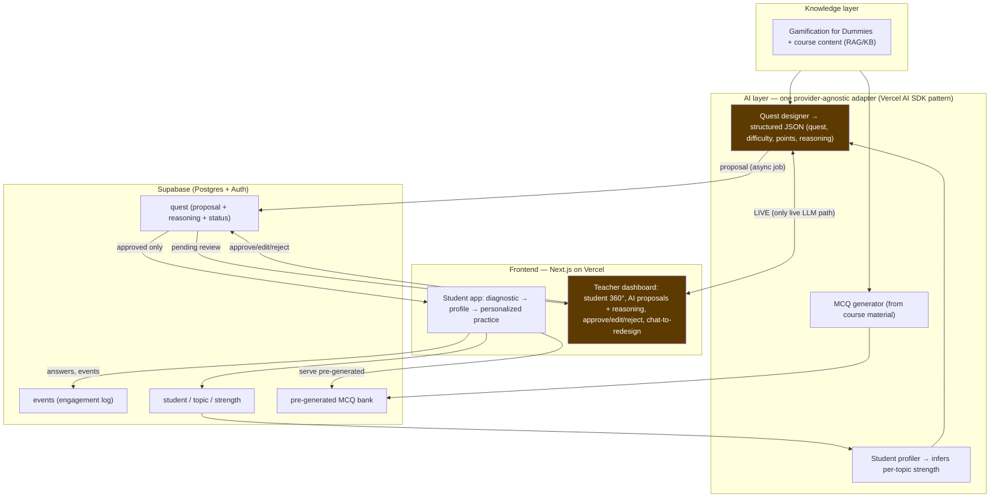

# Architecture & Model Comparison — AI-Personalized Gamification Platform

**Prepared for:** Supervisor meeting, Mon 27 Jul 2026 · **Author:** Sumeet Mohanty (PGDM GM Co'26, XLRI) · **Supervisor:** Prof. Singh *(confirm name spelling before circulation)* · **Version:** Week-1 design.

> **Rule applied throughout:** empirical claims cite a source or are tagged `[unverified]` until the PDF is logged in `docs/literature/`. Model prices/limits are **verified 25 Jul 2026** against live pricing pages and change often — re-check before quoting.
>
> **Companion visuals:** the build roadmap (phase/week) and the end-to-end app-flow diagram (with edge cases) live in [`roadmap-and-flow.md`](roadmap-and-flow.md).

---

## 0. One-paragraph summary

A gamified learning platform in which an **AI layer designs the gamification per student** — quests, difficulty, and *variable* point rewards — from measured performance, under a **teacher approval gate**. The core design thesis is an **anti-comfort-zone economy**: weak topics pay more, and rewards are **uncertain** where the student is weakest (uncertainty is the motivational driver, not the payout). The pilot runs in Prof. Singh's Digital Transformation course from ~mid-Sept 2026, and doubles as an instrument to test a research question — *does a variable reward schedule sustain engagement better than a fixed one, and does that hold with age?* — via a hidden-condition, within-subject design.

---

## 1. Layered architecture



**Data-flow rules (from CLAUDE.md §Stack):**
- **Only one live LLM path** — the teacher's *chat-to-redesign*. Everything else is async or cached: **quest design = background jobs** (HITL approval is already async), **MCQs pre-generated per session and served from the DB** (a classroom burst hits Postgres, not the LLM).
- **One provider-agnostic adapter** for all LLM calls; fallback chain Gemini → retry → alternate. **Hard rule: student-derived data never routes to Chinese-hosted endpoints.** Non-student calls (MCQ drafting from course material) may use cheaper open models.
- **Queue + exponential backoff + response cache** on every LLM call → rate-limit-proof by design.
- *Deviation from the prof's Firebase suggestion → Supabase/Postgres, pitched as **SQL analytics for the engagement dataset**, not as overruling him. Firebase remains the fallback.*

---

## 2. Model comparison + pick

**The runtime LLM must do three jobs** — draft MCQs from course material, infer student strengths, and design quests as **structured JSON** — at classroom scale, cheaply, without sending student data to training pipelines. That points at a **fast/cheap "Flash/mini"-class** model, not a frontier one.

*Prices per 1M tokens (input / output), verified 25 Jul 2026. Scored on the six things that matter here.*

| Candidate (class) | Rate limits | Structured-JSON | Quest-design reasoning | Latency | Cost @ pilot scale | Data-governance fit |
|---|---|---|---|---|---|---|
| **Gemini 3 Flash — paid Tier 1** *(pick)* | ✅ ~150–300 RPM | ✅ native JSON mode | ⚠️ good (not frontier) | ✅ fast | ✅ ~$0.50/$3 | ✅ paid tier: no training-data clause; US/EU-hosted |
| Gemini free tier | ❌ ~5–15 RPM, RPD caps | ✅ | ⚠️ | ✅ | ✅ $0 | ❌ prompts may be used for training |
| DeepSeek/Qwen via OpenRouter | ✅ | ✅ | ⚠️ | ✅ | ✅ ~$0.21/$0.31 (V3.2) | ❌ **Chinese-hosted → banned for student data**; OK for MCQ drafting only |
| Claude Haiku 4.5 | ✅ | ✅ strict tools | ✅ strong | ✅ | ⚠️ ~$1/$5 | ✅ US-hosted |
| GPT-5 mini | ✅ | ✅ | ✅ | ✅ | ✅ ~$0.13/$1.00 | ✅ US-hosted |

**Pick: Gemini 3 Flash on paid Tier 1.** Rationale (the prof made "why this and not that" mandatory):
1. **Privacy + reliability over free tier.** Free tier's ~5–15 RPM collapses under a simultaneous classroom, and its prompts may be used for training — unacceptable for student data. Tier 1 is pay-per-use (no upfront), ~150–300 RPM, no training clause.
2. **Same ecosystem as the free dev tools** already chosen (Google AI Studio, Antigravity) — less context-switching, one SDK family.
3. **Cheapest credible privacy-safe option** at this quality tier; GPT-5-mini and Haiku are strong fallbacks through the same adapter if Gemini quality disappoints on quest-design reasoning.
4. **DeepSeek/Qwen stay in scope only for non-student MCQ drafting** — never for profiling a named student (governance rule).

**Cost at pilot scale (~20 students × 20 sessions):** MCQs are generated **once** per session (~200 total), not per student; quest design is ~1 async call per student per Phase-2 session. Estimated total **well under $5–10/month** — consistent with HANDOFF's estimate. **Blocking item:** this small spend is **pending your sign-off** (CLAUDE.md); until then development runs on free tier but is architected for Tier 1. **Monday is the moment to approve ~₹500–800 for the pilot.**

---

## 3. Data model

```mermaid
erDiagram
    student ||--o{ student_topic_strength : has
    topic   ||--o{ student_topic_strength : measured_in
    student ||--o{ quest : receives
    topic   ||--o{ quest : targets
    student ||--o{ event : generates

    student { uuid id; text cohort; text age_bracket; timestamptz created_at }
    topic { text id; text course_id; text name; text parent_id }
    student_topic_strength { uuid student_id; text topic_id; real strength; text source; timestamptz inferred_at }
    quest { uuid id; uuid student_id; text topic_id; int phase; text difficulty; int point_value; text reasoning; text status; text approved_by; timestamptz approved_at }
    event { bigint id; text session_id; text age_bracket; text stage; text topic; text question_id; bool is_correct; text condition; real strength_at_time; int base_reward; int awarded_reward; text event_type; timestamptz created_at }
```

Notes:
- **`student_topic_strength.source ∈ {seeded, ai_inferred}`** — strength is *measured*, not fixed; the demo already computes it from the diagnostic (`src/lib/profile.ts`).
- **`quest.reasoning` is a first-class column, not a log line** — it is the artifact the HITL layer exists to review. `quest.status ∈ {proposed, approved, edited, rejected, delivered}` *is* the approval workflow. (This layer is the one you were most energized by.)
- **`event`** matches `supabase/migrations/0001_events.sql` field-for-field so the demo and the doc never drift. `condition` (fixed/variable) and `stage` (diagnostic/practice) are the research instrument (Section 5).

---

## 4. Phase 1 vs Phase 2 + switching trigger

- **Phase 1 (identical baseline for everyone) = the diagnostic.** No personalization; it *measures* per-topic strength.
- **Phase 2+ (AI-personalized).** Quests/rewards are AI-designed per student, weighted toward weak topics.
- **Switching trigger (proposed — your call):** Phase 2 begins for a student once they have completed **N = 3 sessions' worth of MCQs with ≥1 answered item in each top-level topic** — enough signal to infer strengths that aren't noise. Per-student (not cohort-wide) so late joiners aren't mis-profiled. *Failure modes: too early → personalizes off noise; too late → wastes pilot sessions.* **N is open question #1.**

---

## 5. Learning-science & research design *(the extension — present as a hypothesis you can veto)*

**Thesis:** revealed behavior beats self-report. Rather than asking students what motivates them (à la MBTI — poor reliability, ~50% reclassify on retest, ~1% of leadership-behavior variance, Barnum effect `[unverified]`), the platform *observes how they play*. The rigorous personality anchor, if we go there, is **Big Five/OCEAN**, and the player-type layer is **HEXAD-12**, not Bartle (the literature explicitly says Bartle shouldn't be used for gamification) `[unverified]`.

**The core mechanic (two orthogonal dials, isolated for attribution):**
1. **Magnitude — anti-comfort-zone:** `base(strength) = 10 + 40·(1 − strength)` → weak topics pay more.
2. **Uncertainty — variable reward:** a two-outcome payout whose *hit probability rises with strength* (`p = 0.5 + 0.5·strength`), so uncertainty is **maximal exactly where the student is weakest**. Grounded in Fiorillo, Tobler & Schultz (2003): dopamine encodes *reward uncertainty*, maximal at P≈0.5 `[unverified]`. Crucially, **fixed and variable conditions are matched on expected value** (E[multiplier]=1, unit-tested), so any behavioral difference is attributable to *uncertainty alone*, not to payout size.

**How we measure it honestly (from the design review):**
- **Hidden conditions.** The fixed/variable label is *never shown to students* — naming it primes them and kills the effect. Condition is assigned **per student, counterbalanced 2:2, randomized across topics**, and lives only in the logs.
- **Engagement is the dependent variable, not points.** Points are EV-matched, so they can't differentiate students. We measure **voluntary persistence** — does the student choose to keep practicing? — captured as `practice_continue`/`practice_stop` events. (Gamification reliably moves engagement; it moves *learning* far less reliably `[unverified]` — so engagement is the honest primary outcome.)
- **Within-subject design.** Each student is their own control (fixed vs. variable across matched-strength topics). This is essential because the pilot is **underpowered for a between-subjects age effect**: detecting a small effect (the JMIR-Aging meta-analysis put gamification's benefit for older adults at SMD≈0.34 `[unverified]`) needs **≈136 per group** at 80% power — we have ~20 students. **The pilot is therefore feasibility/discovery, and the age arm is exploratory** until cohorts are pooled.
- **Measurement reliability — captured live, refined per round.** Strength is a **running estimate updated on every answer**, not a one-shot reading: the diagnostic sets a baseline, then each practice round adds evidence and **re-personalizes** (weak topics resurface until they aren't weak). More rounds → more observations → a more confident **final strong/weak measurement** (a stable capstone screen showing each topic's level and its change since the diagnostic). Estimates use **shrinkage toward 0.5** (few items → less confidence); the rigorous upgrade — **roadmap, not built** — is **adaptive testing (CAT / Item Response Theory)**, the same principle as a long personality inventory. Rounds are *insertable modules* before the capstone: the pilot can run 1 or many, and the engagement/analytics stream is continuous throughout. A weak topic is prioritized **weakest-first every round**, and once its fresh items run out, questions the student **missed** re-surface as flagged **Review** (spaced repetition) so the weak area keeps coming back until mastered — but review re-attempts are **excluded from the strength measurement** (the answer was already shown) and pay no points (so they can't game the reward economy). In production the AI generates *fresh* weak-topic items each round, so review is a stopgap for the fixed demo bank, not the end state.

**The age × reward-schedule hypothesis (your original contribution):** standard fixed points/badges lose potency as the dopamine system ages (striatal D2/D3 decline; novelty-seeking decline `[unverified]`) — so the claim is **"wrong reward *schedule*," not "gamification fails with age."** The literature shows gamification *works* for 30+, just weakly; our bet is that *variable* rewards stay potent where fixed ones fade. Age is a **measured covariate, held out of the mechanic** (baking age in would make the hypothesis circular). Pilot subjects are students aged 22+; we aim to recruit a small **30+ voluntary, non-graded cohort** to populate the age arm (which also removes the grade-coercion confound).

> **What is contested (stated plainly):** whether *personalized* gamification beats *generic* is genuinely unsettled — some studies find a clear benefit, at least one well-run study finds **no significant difference** `[unverified]`. That is *why this is a real test*, not a foregone conclusion. We lead with the **variable-reward pillar** (strongest evidence — neuroscience + a billion-user existence proof in Duolingo `[unverified]`) and position personalization as the hypothesis under test.

---

## 6. Roadmap beyond the wedge (not in the pilot)

- **Competition (Phase 2 arm).** A synchronized/timed, leaderboard-driven round — reaching the *competition* and *relatedness* levers (SDT; your supervisor's own research area). Deliberately kept **separate** from the reward measurement: adding competition on top would re-confound engagement, so it runs as a later round or a distinct study arm, not mixed in.
- **HITL at scale.** If one teacher can't sustain ~400 approvals, shift to **pre-generated quest banks + guardrailed auto-approval** (set rules once, spot-check) — keeps the differentiator while removing the bottleneck.
- **HEXAD player-type inference** from gameplay; **CAT** diagnostic; **Big Five** correlation study.

---

## 7. Open questions for you (Monday)

1. **N for the Phase-1→Phase-2 trigger** — is 3 sessions right?
2. **Skill-taxonomy granularity** for the DT course — how many topics, what depth?
3. **Approval: blocking or async?** Does teacher approval gate delivery, or run approve-after?
4. **Ethics/IRB timeline** for classroom telemetry — who owns it, does it fit before mid-Sept? *(HANDOFF flags: ask before the pilot, not after.)*
5. **Gemini Tier 1 spend sign-off** (~₹500–800) — approve the small runtime cost?
6. **30+ cohort** — acceptable to recruit a small voluntary non-graded group for the age arm?
7. Confirm **hosting = Vercel** and identify the **"Chinese model"** from the 21 Jul call (both garbled in the transcript).

---

## 8. Risks (top 3, from the devil's-advocate review)

| Risk | Why it matters | Mitigation |
|---|---|---|
| **Confounded design** | If magnitude + variance + personalization + age all vary at n≈20, no effect is attributable | Isolate one variable (fixed vs variable, matched EV, hidden) — **done in the demo** |
| **HITL won't scale** (~400 approvals) | Forces auto-approval → deletes the differentiator | Timed-review test in first 2 weeks; pre-generated bank + guardrails as fallback |
| **Underpowered / inconclusive** | ~20 students can't confirm a small age effect | Reframe as feasibility; within-subject; pool future cohorts; engagement (not learning) as DV |

*Full analysis: `docs/venture-analysis/Prompt 3 - Devils Advocate Teardown.md`.*

---

## Appendix — working prototype

A runnable Next.js prototype (`/`, this repo) already implements the Section-5 mechanic end-to-end: **diagnostic → measured profile → personalized practice** with hidden fixed/variable conditions, the anti-comfort-zone + uncertainty reward engine (property-tested: EV-matched, variance-isolated), age capture, and per-interaction event logging (console or Supabase). Run: `npm install && npm run dev`. Toggle **"Researcher view"** to reveal the hidden conditions and measured strengths for explanation.
