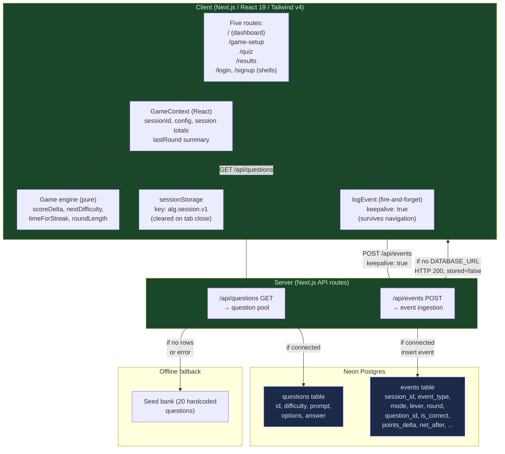

# Architecture as Built: 28 Jul 2026

**Prepared for:** Project record · **Date:** 28 Jul 2026 · **System state:** commit e0b3fd9, running locally, not pushed.

This document describes the system actually built after the 27 Jul pivot toward a gamified adaptive-learning dashboard. The 27 Jul architecture docs (AI-designed quests with teacher approval, variable-reward experiment) are superseded; see the "Status" section below.

---

## Status

On 27 Jul the supervisor pivoted the project from its original AI-personalized quest design to a simpler gamified dashboard framed as Design Science Research. The codebase was rebuilt to match on 28 Jul.

- **27 Jul docs** (`2026-07-27_architecture-and-model-comparison.md` and `roadmap-and-flow.md`): described the quest-design + teacher-approval vision. Those docs stand as historical record but do not describe the built system.
- **This doc:** describes what was actually implemented.
- **Unchanged:** `docs/architecture/data-layer.md` and `docs/architecture/agent-orchestration.md` remain current.

---

## One-paragraph summary

A gamified adaptive-learning dashboard where students choose a challenge lever (adaptive difficulty or time pressure) and play rounds of multiple-choice questions with fixed +20 points for correct answers, −10 for wrong. Difficulty adapts per answer in adaptive mode; in time mode, difficulty is fixed at level 3 and the countdown tightens instead. State persists in browser sessionStorage across route navigation within a tab. Questions come from a Neon Postgres database or fall back to a hardcoded seed bank when the database is unavailable. Events (session start, round start, question answered, round continue/stop) are logged client-side and posted asynchronously to the server, which inserts them into Neon when connected. There is no teacher dashboard, no AI-generated quests, no per-student personalization, and no working authentication backend.

---

## Runtime architecture



---

## Verified implementation details

### Routes (5 total)

| Route | File | Purpose | State |
|-------|------|---------|-------|
| `/` | `app/page.tsx` | Dashboard; shows session totals (net, potential, accuracy, rounds, continues) and links to game-setup | Built, live |
| `/game-setup` | `app/game-setup/page.tsx` | Chooses mode (rapid/normal) and lever (adaptive/time), sets fixedDifficulty for time mode | Built, live |
| `/quiz` | `app/quiz/page.tsx` | Renders questions and collects answers, manages the round loop | Built, live |
| `/results` | `app/results/page.tsx` | Displays round summary and offers "Keep Going → Next Round" (persist lever, continue) or "Back to Dashboard" | Built, live |
| `/login` | `app/login/page.tsx` | **UI shell, no backend.** Renders a form, simulates a 1s delay, redirects to `/`. No credentials are checked. | UI only |
| `/signup` | `app/signup/page.tsx` | **UI shell, no backend.** Same as login. | UI only |

Login and signup are reachable via in-page links within their own components but **have no incoming links from the game flow.** A student lands at `/` directly.

### Game engine (`lib/game/engine.ts`) — pure, testable, reusable

**Scoring:**
- Correct answer: +20 net, +20 potential.
- Wrong answer: −10 net, 0 potential.

**Difficulty (adaptive mode only):**
- `nextDifficulty(current, correct)`: correct → +1 level, wrong → −1 level, clamped to 1–5.
- Time mode uses a fixed difficulty (default level 3) for the entire round.

**Time (time mode only):**
- `timeForStreak(consecutiveCorrect)`: starts at 10s for the first question, subtracts 2s per consecutive correct answer, floored at 5s. A timeout is committed as a wrong answer and costs −10 points.

**Round length:**
- `roundLength(mode)`: rapid = 10 questions, normal = 20 questions.

The engine is pure and therefore testable, but **there are no tests**. The repository has no test framework, no test script in `package.json`, and no test files. Verification to date is `npm run build` plus manual play.

### State management (`lib/game/game-context.tsx`)

A React context provider holds session-level state:

- `sessionId`: a random UUID or fallback timestamp-based ID, generated once on first load.
- `config`: the lever choice (adaptive/time) and mode (rapid/normal), set on `/game-setup` and persisted until the session ends.
- `session`: running totals across all rounds: net, potential, roundsPlayed, continues, correct, wrong, answered.
- `lastRound`: summary of the most recent round (net, potential, correct, wrong, answered, peakDifficulty, bestTimeMs, lever, mode).

**Persistence:** Backed by `sessionStorage` under the key `alg.session.v1`. State survives route navigation within the same tab. **Not verified:** behavior on page refresh. State is cleared when the tab closes.

**Event emission:** `context.emit(event)` appends the sessionId and posts the event asynchronously via `logEvent()`.

### Question supply (`app/api/questions/route.ts`)

GET `/api/questions` returns a JSON object `{ source: 'db' | 'seed', questions: Question[] }`.

**With database:** Queries the `questions` table (id, difficulty, prompt, options, answer). Difficulty is clamped to 1–5.

**Without database:** Falls back to `QUESTIONS` from `lib/game/questions.ts`, a 20-question hardcoded seed bank tagged by difficulty, themed on Digital Transformation / business terminology.

**Question selection** (`lib/game/questions.ts`, `pickQuestion(pool, difficulty, usedIds)`): Returns a random unused question at the target difficulty. If none exists, widens the difficulty radius (±1, then ±2, etc.). If still none, returns any unused question. If the pool is exhausted, returns null (the UI is responsible for handling "no more questions").

### Event logging

**Client side** (`lib/log/logEvent.ts`):
- Five event types: `session_start`, `round_start`, `question_answered`, `round_continue`, `round_stop`.
- Fire-and-forget: `logEvent()` issues an async fetch with `keepalive: true`, so events posted during navigation survive the page transition.
- In dev, echoes to console.
- No retry or queuing; dropped events are not recovered.

**Server side** (`app/api/events/route.ts`):
- POST `/api/events` accepts a JSON event object.
- If `DATABASE_URL` is set: inserts into the `events` table and returns `{ ok: true, stored: true }`.
- If `DATABASE_URL` is not set: returns `{ ok: true, stored: false }` (silent no-op, the app continues).

### The persistence loop ("Keep Going")

Results screen offers two buttons: "Keep Going → Next Round" and "Back to Dashboard".

- **Keep Going:** calls `registerContinue()` to increment the `continues` counter, then navigates straight to `/quiz`, **skipping `/game-setup`**. The lever and mode choices carry over from the previous round.
- **Back to Dashboard:** navigates to `/`. It does **not** reset the session — cumulative totals and the lever/mode config survive, so the student can start another round from the dashboard and it still counts toward the same session.

This is the mechanism for measuring voluntary persistence (the `continues` counter and `round_continue` events).

### Database client (`lib/db/client.ts`)

A singleton that wraps the Neon serverless Postgres client:

```typescript
export function getSql(): NeonQueryFunction | null
```

Returns the client if `DATABASE_URL` is set, otherwise null. All downstream code that uses `getSql()` checks for null and degrades gracefully (questions fall back to seed, events no-op).

---

## What is deliberately deferred vs. what is missing

### Deliberately deferred (architectural holes waiting for Phase 2+)

These are features whose absence is planned; they are mentioned in CLAUDE.md or known from the pivot:

- **AI quest designer:** The AI layer, adapter pattern, and quest + reasoning schema are designed in the 27 Jul docs but not implemented. The supervisor may restore this in a future phase.
- **Teacher dashboard:** Needed for the human-in-the-loop approval loop. Designed but not built.
- **Per-student personalization:** No student profiler, no strength inference, no AI-designed difficulty ramps or reward levels. Phase 2 feature.
- **MCQ generation as a server-side job:** Generation itself is **built** — `scripts/generate-questions.mjs` reads a PDF with `pdf-parse`, sends an excerpt to Gemini, and upserts the resulting MCQs into the `questions` table (see `data-layer.md` for the full path). What is deferred is running it as an async job: today it is a manual command a human runs locally, with no upload UI, no scheduling, and no per-session pre-generation.
- **Large PDF chunking:** The generator sends only the first ~12,000 characters of a document. Chunking a full book across multiple calls is designed but not implemented.
- **Competition arm:** Mentioned in the 27 Jul docs as a Phase 2 feature; not built.
- **CAT / adaptive testing:** Mentioned as a future upgrade; the current difficulty logic is simple ±1 ramping.
- **HEXAD player-type inference:** Designed in the 27 Jul docs; not implemented.

### Completely missing (not part of the current scope)

- **Working authentication:** Login and signup are shells. There is no user database, no credential checking, no session tokens. Every student gets a new sessionId on first load.
- **Student identity tracking across sessions:** Each tab session is independent. Closing the tab loses all state. Reopening the app generates a new sessionId.
- **Multi-student management:** No cohort concept, no roster, no way to partition students or aggregate results.
- **Data export or analytics dashboard:** No UI to inspect the events table or generate reports.
- **Age bracket tracking:** The seed bank does not capture age. The events table has no age_bracket column in the current schema (this was a 27 Jul feature that did not survive the pivot).
- **Skill taxonomy:** No topic tags, no way to target questions by subject.
- **Spaced repetition or review queue:** Missed questions do not resurface; they are simply deducted from the available pool.

---

## What has and has not been verified

### Verified by code inspection

- Engine logic (scoreDelta, nextDifficulty, timeForStreak, roundLength) matches the spec and is testable.
- Context state persists to sessionStorage with key `alg.session.v1` and survives route navigation.
- Questions API returns `{ source: 'db' }` or `{ source: 'seed' }` depending on connection.
- Events API accepts POST requests and inserts to Neon when connected.
- Login/signup components are UI shells with no backend integration.
- Five routes exist as described; login and signup have no incoming links from the game flow.
- The persistence loop ("Keep Going") increments continues and skips game-setup, carrying the lever choice forward.

### Not verified (no test evidence or manual test data)

- Behavior on page refresh (does sessionStorage hydrate correctly, or is state lost?).
- Whether a timeout in time mode is correctly committed as a wrong answer and costs −10 points (quiz UI logic is complex; this would require tracing through a quiz playthrough).
- Whether the keepalive flag on logEvent actually ensures events survive navigation (browser support is good but timing-dependent).
- Whether difficulty widening in pickQuestion works as intended when the exact difficulty runs out of unused questions.
- Whether the seed bank is reached when Neon is disconnected (code path exists, but untested against a real database failure).
- Whether the session persists correctly across a long round (state updates are batched; potential race conditions not ruled out).

---

## Database schema (current)

Two tables exist in Neon (see `docs/architecture/data-layer.md` for full schema):

**questions**
- id, difficulty, prompt, options (JSON), answer (index)

**events**
- session_id, event_type, mode, lever, round, question_id, is_correct, points_delta, negative_applied, net_after, created_at, ...

---

## Stack and deployment

- **Runtime:** Next.js 16 on Vercel Hobby (cost: free tier).
- **Database:** Neon serverless Postgres (cost: free tier during dev; small paid tier during pilot).
- **Frontend:** React 19, Tailwind CSS v4.
- **Styling:** Aurora Glass theme (animated gradient mesh, frosted glass, celebratory animations). See `app/layout.tsx` and component files.
- **State:** sessionStorage (browser) + React context (in-memory).
- **Auth:** None (login/signup shells only).

---

## References and related documents

- `docs/architecture/data-layer.md`: Database schema details (current).
- `docs/architecture/agent-orchestration.md`: How subagents coordinate to build this codebase (current).
- `CLAUDE.md`: Project rules and constraints (current).
- `HANDOFF.md`: Full project history and decisions up to 28 Jul.
- `2026-07-27_architecture-and-model-comparison.md`: **Superseded.** Describes the quest-design vision that was replaced.
- `roadmap-and-flow.md`: **Superseded.** Describes the Phase 1 → Phase 2 trigger and the reward experiment that was removed.
