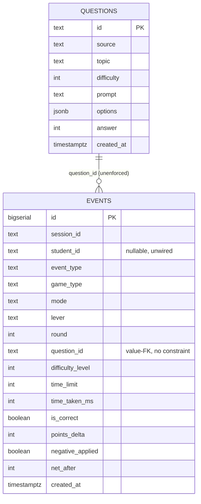

# Data Layer — As Built (28 Jul 2026)

This describes the data layer exactly as it exists in the codebase today, not the target state.
It is documentation only — no schema, code, or SQL was changed to produce it.

## 1. Where the data lives

Postgres on Neon (serverless), accessed via `@neondatabase/serverless`. The only client is
`lib/db/client.ts`:

```ts
let cached: NeonQueryFunction<false, false> | null | undefined
export function getSql() {
  if (cached !== undefined) return cached
  const url = process.env.DATABASE_URL
  cached = url ? neon(url) : null
  return cached
}
```

`getSql()` is called lazily by every route that touches the database and is memoized for the life
of the server process. If `DATABASE_URL` is not set, `getSql()` returns `null` and every caller is
written to treat that as "no database" rather than throw. There is no separate pooled vs. direct
connection string handled in code — `schema.sql`'s header comment recommends the pooled Neon
connection string for classroom burst load, but that is an operational choice made when
`DATABASE_URL` is set in the environment, not something the client enforces.

Concretely, absence of `DATABASE_URL` degrades two ways, both non-fatal to the app:
- `/api/questions` falls back to the in-memory seed bank (`lib/game/questions.ts`).
- `/api/events` accepts the POST and returns `{ ok: true, stored: false }` without writing anything.

## 2. Schema

Canonical file: `db/schema.sql`. Two tables, no foreign key between them yet (see Gaps).

### `questions` — the question bank

| Column | Type | Meaning in game terms |
|---|---|---|
| `id` | `text` PK | Stable question identifier, e.g. `digital-transformation-d3-7`. Used to dedupe on re-generation (`on conflict (id) do update`) and to reference a question from `events.question_id`. |
| `source` | `text` | Name of the source document (book/PDF) the question was generated from. |
| `topic` | `text` | Intended sub-topic tag. **Not populated by the current generator** — every row has `topic = null` today. |
| `difficulty` | `int`, check 1–5 | The difficulty tier the item was written for (5 = hardest). Drives the adaptive-difficulty selection in `pickQuestion`. |
| `prompt` | `text` | The MCQ stem shown to the student. |
| `options` | `jsonb` (string[]) | The four answer choices, in display order. |
| `answer` | `int` | Index into `options` of the correct choice. |
| `created_at` | `timestamptz` | Row creation time, defaults `now()`. |

### `events` — the research dataset (per-interaction log)

| Column | Type | Meaning in game terms |
|---|---|---|
| `id` | `bigserial` PK | Row identity, also gives a stable global ordering as a tiebreaker on `created_at`. |
| `session_id` | `text` not null | A client-generated UUID that identifies one browser session (created once, persisted in `sessionStorage`, reused for every event until the tab's storage is cleared). This is the closest thing today to a "who did this" key. |
| `student_id` | `text`, nullable | Intended FK to an authenticated student. Comment in schema: `-- future: from auth`. Currently always `null` (see Gaps §1). |
| `event_type` | `text` not null | One of `session_start`, `round_start`, `question_answered`, `round_continue`, `round_stop` — the state-machine markers described in §4. |
| `game_type` | `text` | Which game produced the event; currently always `'quiz'`. Placeholder for future game types (crossword, word-search). |
| `mode` | `text` | Student-chosen pacing: `rapid` or `normal`. |
| `lever` | `text` | Student-chosen adaptivity lever: `adaptive` (difficulty ramps with performance) or `time` (fixed difficulty, shrinking time limit). This is the paper's key independent variable. |
| `round` | `int` | 0-based round counter within the session. |
| `question_id` | `text` | FK-by-value into `questions.id` (no DB-level constraint — see Gaps). Null for non-`question_answered` events. |
| `difficulty_level` | `int` | The difficulty (1–5) the question was actually served at, at the moment of the event. |
| `time_limit` | `int` | Seconds allowed for this question, only meaningful when `lever = 'time'`. |
| `time_taken_ms` | `int` | Wall-clock time from question shown to answer committed. |
| `is_correct` | `boolean` | Correctness of the submitted answer. |
| `points_delta` | `int` | Net point change for this single answer (currently +20 correct / −10 incorrect, from `scoreDelta`). |
| `negative_applied` | `boolean` | Whether the negative-marking penalty fired (true whenever `is_correct = false`, given current scoring). |
| `net_after` | `int` | Running net point total within the round, after this answer. |
| `created_at` | `timestamptz` | Server-side event timestamp, defaults `now()`. |

Indexes today: `events_session_idx on (session_id)`, `events_type_idx on (event_type)`.

### Entity-relationship diagram



## 3. How data flows

### Path A — question supply

1. A human runs `node scripts/generate-questions.mjs <book.pdf> "Source Name" [perDifficulty]`
   locally. It reads `GEMINI_API_KEY` and `DATABASE_URL` from `.env.local`, extracts PDF text with
   `pdf-parse`, and sends the first ~12,000 characters to Gemini (`gemini-2.0-flash` by default)
   asking for `perDifficulty` MCQs per difficulty level 1–5 as strict JSON.
2. The script parses the model's JSON (with a regex-extraction fallback if the model wraps it in
   prose) and `insert ... on conflict (id) do update`s each item into `questions`, keyed by a slug
   built from the source name plus difficulty and index.
3. At request time, `app/api/questions/route.ts` calls `getSql()`. If a client exists, it selects
   `id, difficulty, prompt, options, answer from questions`. If that query returns at least one
   row, it clamps difficulty into 1–5 and returns `{ source: 'db', questions }`.
4. **Fallback (silent, by design):** if `getSql()` is null, the query throws, or the table is
   empty, the route falls through to `{ source: 'seed', questions: QUESTIONS }` — the 20
   hand-written questions in `lib/game/questions.ts`. The game plays identically either way; the
   response body's `source` field is the only signal of which path served the request, and nothing
   currently logs or surfaces that field to the researcher.
5. `lib/game/questions.ts`'s `pickQuestion` then selects an unused question at (or nearest to) the
   requested difficulty from whichever pool was returned.

**Degradation summary:** no `DATABASE_URL`, no rows in `questions`, or a query error all produce
the *same* seed-bank experience with no error surfaced to the student or logged anywhere. A
session that ran entirely on the seed bank looks identical in the `events` log to one that ran on
generated content — `events` has no column recording which question source was in play beyond the
`question_id` value itself (seed IDs are `q1`..`q20`; generated IDs are `<slug>-d<n>-<i>`, so it is
recoverable by pattern-matching `question_id`, but only if the analyst knows to do it).

### Path B — event capture

1. A student action (page load, round start, answer submit, "keep going" click, round stop) calls
   `emit(...)` in `lib/game/game-context.tsx`, which calls `logEvent(...)` from
   `lib/log/logEvent.ts`, injecting the session's `session_id`.
2. `logEvent` is fire-and-forget: outside the browser (SSR) it is a no-op; in the browser it always
   `console.info`s the event when `NODE_ENV !== 'production'`, then `fetch('/api/events', ...)`
   with `keepalive: true` so the request can survive a navigation, swallowing any network error.
3. `app/api/events/route.ts` parses the JSON body (400 on malformed JSON), calls `getSql()`. If no
   client, it returns `{ ok: true, stored: false }` and **the event is gone** — nothing is
   persisted, only the dev-console mirror (if any) existed. If a client exists, it inserts a row
   into `events` with all the columns in §2, coalescing missing optional fields to `null`. A
   database error is caught and returned as a 500 with the error message; the client's `.catch(() =>
   {})` means the student-facing UI never sees or reports this failure.

**Degradation summary:** three silent-loss points exist: (a) no `DATABASE_URL` in the deployed
environment — the entire event log becomes vaporware, only visible via browser dev consoles on
individual machines in dev mode; (b) a transient Neon error (cold start, rate limit) drops that one
event with no retry and no client-side surfacing; (c) in production builds (`NODE_ENV ===
'production'`), the console mirror is also suppressed, so a production outage of the events table
leaves *zero* trace anywhere. A future reader should treat `events` row counts as a lower bound on
actual gameplay, never as a complete census, unless someone has verified `DATABASE_URL` was live
for the full pilot window.

## 4. What the event log can answer

Given `session_id`, `round`, `event_type`, `lever`, `mode`, `difficulty_level`, `time_taken_ms`,
`is_correct`, `points_delta`, and `net_after`, the following are answerable in SQL today, at
session grain (not yet at student grain — see Gaps §1):

- Per-question correctness and latency by chosen lever: does the `time` lever produce faster or
  more error-prone answers than `adaptive`, controlling for difficulty?
- Difficulty progression within a round: does `difficulty_level` trend upward across successive
  `question_answered` rows for a given `(session_id, round)` under the adaptive lever, and does it
  correlate with `is_correct` streaks?
- Persistence: how many `round_continue` events precede a `round_stop`, and does that count differ
  by `mode` or `lever` (the "continues" field in `game-context.tsx` is explicitly commented as the
  persistence dependent variable)?
- Point trajectory: does `net_after` recover after a negative `points_delta`, and how quickly,
  within a session?

Example queries:

```sql
-- Accuracy and mean latency by lever, at each difficulty level.
select lever, difficulty_level,
       count(*) filter (where is_correct) as correct,
       count(*) as total,
       avg(time_taken_ms) as mean_ms
from events
where event_type = 'question_answered'
group by lever, difficulty_level
order by lever, difficulty_level;

-- Continues before stopping, per session and round.
select session_id, round,
       count(*) filter (where event_type = 'round_continue') as continues,
       max(created_at) filter (where event_type = 'round_stop') as stopped_at
from events
where round is not null
group by session_id, round;

-- Difficulty trajectory within one round (ordered by time, since there is no
-- per-question sequence column).
select session_id, round, created_at, difficulty_level, is_correct
from events
where event_type = 'question_answered'
order by session_id, round, created_at;
```

That last query is a workaround, not a clean answer — see Gaps §3.

## 5. Known gaps

Ordered by how much they hurt the paper.

**1. `student_id` is nullable and never populated — every event is anonymous.** Login and signup
pages exist (`app/login/page.tsx`, `app/signup/page.tsx`) but both are pure front-end mock-ups:
`handleSubmit` does `await new Promise(resolve => setTimeout(resolve, 1000))` and redirects to
`/`, with no API call, no session, no identity anywhere. The only identity primitive in the system
is `session_id`, a random UUID minted client-side and stored in `sessionStorage` (cleared when the
tab/browser session ends, not tied to a device or person). This means:
  - No analysis can be done **per student** — no learning-curve-over-time, no within-subject
    comparison of `lever` choice across sessions, no linking classroom roster data (grade,
    demographics, prior performance) to gameplay at all.
  - Because `sessionStorage` (not `localStorage`) is used, even the same student on the same
    device on two different days produces two unrelated `session_id`s with no way to stitch them
    together after the fact. There is no cookie, device fingerprint, or persisted identifier to
    fall back on.
  - Every research question that needs "the same student, over time" (which is most of the paper's
    design, given a ~20-session pilot) is currently unanswerable.
  - **Options, with trade-offs:**
    - Wire real auth (even a minimal email+password or magic-link flow) and pass the authenticated
      user's ID into `logEvent`/`GameProvider`. Correct long-term fix; costs real build time and a
      login/session-token design before Phase 2 personalization can even work (the AI layer also
      needs to know who it's personalizing for, so this is not solely a logging concern).
    - Short-term instrument-only fix: have the student enter a stable roster ID (e.g., student
      email or college ID) once per browser via a simple prompt, store it in `localStorage` (not
      `sessionStorage`) instead of building auth, and send it as `student_id`. Cheap, but
      self-reported and spoofable, and still doesn't solve session-linking across devices.
    - Do nothing until Phase 2 auth is built, and accept that Phase 1 baseline data is
      session-level only, not student-level. Lowest effort, but if Phase 1 is meant to be a
      pre/post baseline for the same cohort, this option quietly forecloses that comparison.

**2. No foreign key from `events.question_id` to `questions.id`, and no way to tell whether a
session played the seed bank or generated content.** `question_id` is stored as free text with no
`references questions(id)` constraint, so a typo'd or dangling ID is silently possible, and joining
`events` to `questions` for item-level analysis (e.g., "which specific question texts have the
highest miss rate") depends on an unenforced convention. Compounding this, `/api/questions`
doesn't tag its response with which source served it in any way that reaches `events` — an analyst
cannot distinguish "this session's questions came from Gemini-generated content" from "this session
silently fell back to the 20-item seed bank" except by pattern-matching `question_id` strings
(`q1`..`q20` vs `<slug>-d<n>-<i>`), which is fragile and undocumented outside this file.

**3. No explicit per-question sequence number.** Ordering questions within a round currently
depends on `created_at` (and `id` as a tiebreaker), which is timestamp-of-insert, not
timestamp-of-display — under concurrent classroom load or clock skew this is not guaranteed to
recover exact display order. An explicit `question_seq` (or reusing `round` alongside an
incrementing per-round counter) would make trajectory queries exact rather than best-effort.

**4. `topic` on `questions` is dead weight today.** The column exists and is presumably intended
for topic-level strength/weakness analysis (directly relevant to the "anti-comfort-zone economy"
design goal), but `scripts/generate-questions.mjs` never sets it, so every row has `topic = null`.
Any query segmenting performance by topic returns nothing. This is cheap to fix (have the
generation prompt ask Gemini to tag a topic string per item) but is currently a silent gap, not a
schema gap.

**5. Missing indexes for the analysis workload.** `events` is indexed on `session_id` and
`event_type` only. Once `student_id` is populated (Gap 1), queries will commonly filter on
`student_id` and on `(session_id, round)` for round-scoped aggregation, and on `question_id` for
item analysis — none of those have indexes yet. Not urgent at pilot data volumes (~20 sessions x
low hundreds of events), but will matter once terms of the analysis run against a full-course
dataset.

**6. `points_delta` and `net_after` encode "current scoring" but not scoring version.** The
schema comment notes points are currently `+20` / `-10` flat. If the game's point economy changes
mid-pilot (a near-certainty once Phase 2 personalization ships variable rewards), there is no
column recording which scoring rule was active for a given event. Without it, a change in observed
`points_delta` distributions over time is ambiguous between "the AI adjusted rewards for this
student" (the actual research signal) and "we shipped a global scoring-formula change" (a
confound). This will be awkward to retrofit — better to add a `scoring_version` or
`points_rule_id` column now, additively, before Phase 2 scoring logic exists, than to try to
reconstruct it later from deploy timestamps.

**7. No table for round-level or session-level summary rows.** Every current row is
per-interaction; round/session aggregates (`potential`, `roundsPlayed`, `peakDifficulty`,
`bestTimeMs` from `game-context.tsx`'s `SessionTotals`/`RoundSummary`) live only in client-side
React state and `sessionStorage`, and are never sent to the server except piecemeal via individual
events. They are reconstructable from `events` with `group by`, but `bestTimeMs` and
`peakDifficulty` specifically are convenience fields that would otherwise need to be recomputed by
every analysis script rather than read once. Not a defect, just a note that no "materialized
round summary" exists server-side; if the paper's analysis code ends up recomputing the same
aggregates repeatedly, a future migration could add a `round_summary` table populated from
`events` via a scheduled job or view, rather than duplicating logic in application code.
