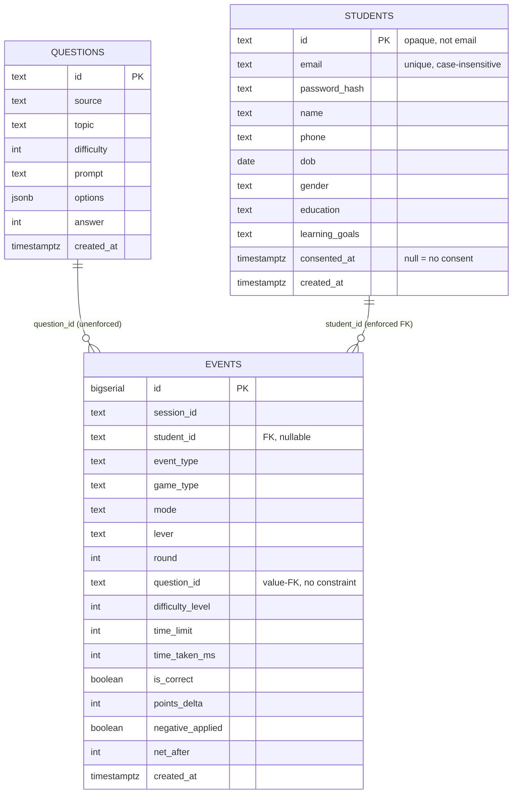

# Data Layer — As Built (28 Jul 2026)

This describes the data layer exactly as it exists in the codebase today, not the target state.
It is documentation only — no schema, code, or SQL was changed to produce it.

## 1. Where the data lives

Postgres on Neon (serverless), accessed via `@neondatabase/serverless`. The only client is
`lib/db/client.ts`:

```ts
let cached: NeonQueryFunction<false, false> | null | undefined
export function getSql() {
  if (cached !== undefined) return cached
  const url = process.env.DATABASE_URL
  cached = url ? neon(url) : null
  return cached
}
```

`getSql()` is called lazily by every route that touches the database and is memoized for the life
of the server process. If `DATABASE_URL` is not set, `getSql()` returns `null` and every caller is
written to treat that as "no database" rather than throw. There is no separate pooled vs. direct
connection string handled in code — `schema.sql`'s header comment recommends the pooled Neon
connection string for classroom burst load, but that is an operational choice made when
`DATABASE_URL` is set in the environment, not something the client enforces.

Concretely, absence of `DATABASE_URL` degrades two ways, both non-fatal to the app:
- `/api/questions` falls back to the in-memory seed bank (`lib/game/questions.ts`).
- `/api/events` accepts the POST and returns `{ ok: true, stored: false }` without writing anything.

## 2. Schema

Canonical file: `db/schema.sql`, with changes shipped as numbered migrations under `db/` (the
convention — `NNN_short_name.sql`, zero-padded, each additive — was established in
`db/001_add_students.sql`, the first migration). Three tables now: `questions`, `students`
(added 28 Jul 2026), and `events`, with a real foreign key from `events.student_id` to
`students.id` (see Gaps for the one still-unenforced FK, `question_id`).

### `questions` — the question bank

| Column | Type | Meaning in game terms |
|---|---|---|
| `id` | `text` PK | Stable question identifier, e.g. `digital-transformation-d3-7`. Used to dedupe on re-generation (`on conflict (id) do update`) and to reference a question from `events.question_id`. |
| `source` | `text` | Name of the source document (book/PDF) the question was generated from. |
| `topic` | `text` | Intended sub-topic tag. **Not populated by the current generator** — every row has `topic = null` today. |
| `difficulty` | `int`, check 1–5 | The difficulty tier the item was written for (5 = hardest). Drives the adaptive-difficulty selection in `pickQuestion`. |
| `prompt` | `text` | The MCQ stem shown to the student. |
| `options` | `jsonb` (string[]) | The four answer choices, in display order. |
| `answer` | `int` | Index into `options` of the correct choice. |
| `created_at` | `timestamptz` | Row creation time, defaults `now()`. |

### `students` — authenticated accounts (added 28 Jul 2026, `db/001_add_students.sql`)

| Column | Type | Meaning in game terms |
|---|---|---|
| `id` | `text` PK | Opaque identifier, `s_` followed by 12 random bytes (base64url). Deliberately not the email and not derived from it, so no direct identifier ever reaches `events`. Generated by `generateStudentId()` in `lib/auth/session.ts`. |
| `email` | `text` not null | Lowercased by the app before insert (`app/api/auth/signup/route.ts`, `.../login/route.ts`). Uniqueness is enforced case-insensitively — see below, not by a plain `unique` constraint on this column. |
| `password_hash` | `text` not null | scrypt output, stored as `"salt:hash"` in hex. Produced and checked by `lib/auth/password.ts`; never compared with `===`, only `timingSafeEqual`. |
| `name` | `text` | Full name, entered at signup. |
| `phone` | `text` | Optional. |
| `dob` | `date` | Date of birth — the age covariate the research design calls for. |
| `gender` | `text` | Free-text select value from the signup form. |
| `education` | `text` | Free-text select value from the signup form. |
| `learning_goals` | `text` | Free-text field from the signup form. |
| `consented_at` | `timestamptz` | Null means consent was not given. Only ever set at signup, to `now()`, when the required consent checkbox is checked; never defaulted or backfilled. |
| `created_at` | `timestamptz` | Row creation time, defaults `now()`. |

Email uniqueness is enforced by `create unique index students_email_lower_idx on students
(lower(email))` rather than a plain unique constraint, so `A@x.com` and `a@x.com` cannot become
two accounts — a plain `unique` on the raw column would not catch that collision.

### `events` — the research dataset (per-interaction log)

| Column | Type | Meaning in game terms |
|---|---|---|
| `id` | `bigserial` PK | Row identity, also gives a stable global ordering as a tiebreaker on `created_at`. |
| `session_id` | `text` not null | A client-generated UUID that identifies one browser session (created once, persisted in `sessionStorage`, reused for every event until the tab's storage is cleared). This is the closest thing today to a "who did this" key. |
| `student_id` | `text`, nullable, FK → `students.id` | Set from the signed session cookie server-side (`getCurrentStudent()` in `app/api/events/route.ts`), never from the request body — a client-supplied id would be forgeable and would corrupt the dataset. `/` was gated on 28 Jul 2026, so a null value in ordinary play should no longer occur; it is the fallback if the FK insert fails (see Gaps §7), the signature of the cross-tab mismatch guard (Gaps §8), or a leftover row from pre-gate testing. |
| `event_type` | `text` not null | One of `session_start`, `round_start`, `question_answered`, `round_continue`, `round_stop` — the state-machine markers described in §4. |
| `game_type` | `text` | Which game produced the event; currently always `'quiz'`. Placeholder for future game types (crossword, word-search). |
| `mode` | `text` | Student-chosen pacing: `rapid` or `normal`. |
| `lever` | `text` | Student-chosen adaptivity lever: `adaptive` (difficulty ramps with performance) or `time` (fixed difficulty, shrinking time limit). This is the paper's key independent variable. |
| `round` | `int` | Round counter within the session, **1-based as written** (`roundNo = session.roundsPlayed + 1`) and restarting at 1 in every new session. It is therefore not unique across sessions: any lifetime round count must aggregate on `(session_id, round)`, never on `round` alone. Verified against live rows 28 Jul 2026. |
| `question_id` | `text` | FK-by-value into `questions.id` (no DB-level constraint — see Gaps). Null for non-`question_answered` events. |
| `difficulty_level` | `int` | The difficulty (1–5) the question was actually served at, at the moment of the event. |
| `time_limit` | `int` | Seconds allowed for this question, only meaningful when `lever = 'time'`. |
| `time_taken_ms` | `int` | Wall-clock time from question shown to answer committed. |
| `is_correct` | `boolean` | Correctness of the submitted answer. |
| `points_delta` | `int` | Net point change for this single answer (currently +20 correct / −10 incorrect, from `scoreDelta`). |
| `negative_applied` | `boolean` | Whether the negative-marking penalty fired (true whenever `is_correct = false`, given current scoring). |
| `net_after` | `int` | Running net point total within the round, after this answer. |
| `created_at` | `timestamptz` | Server-side event timestamp, defaults `now()`. |

Indexes today: `events_session_idx on (session_id)`, `events_type_idx on (event_type)`,
`events_student_idx on (student_id)`, `events_session_round_idx on (session_id, round)`. The
latter two were added in `db/001_add_students.sql` alongside the `students` table (see Gaps §4).

### Entity-relationship diagram



## 3. How data flows

### Path A — question supply

1. A human runs `node scripts/generate-questions.mjs <book.pdf> "Source Name" [perDifficulty]`
   locally. It reads `GEMINI_API_KEY` and `DATABASE_URL` from `.env.local`, extracts PDF text with
   `pdf-parse`, and sends the first ~12,000 characters to Gemini (`gemini-2.0-flash` by default)
   asking for `perDifficulty` MCQs per difficulty level 1–5 as strict JSON.
2. The script parses the model's JSON (with a regex-extraction fallback if the model wraps it in
   prose) and `insert ... on conflict (id) do update`s each item into `questions`, keyed by a slug
   built from the source name plus difficulty and index.
3. At request time, `app/api/questions/route.ts` calls `getSql()`. If a client exists, it selects
   `id, difficulty, prompt, options, answer from questions`. If that query returns at least one
   row, it clamps difficulty into 1–5 and returns `{ source: 'db', questions }`.
4. **Fallback (silent, by design):** if `getSql()` is null, the query throws, or the table is
   empty, the route falls through to `{ source: 'seed', questions: QUESTIONS }` — the 20
   hand-written questions in `lib/game/questions.ts`. The game plays identically either way; the
   response body's `source` field is the only signal of which path served the request, and nothing
   currently logs or surfaces that field to the researcher.
5. `lib/game/questions.ts`'s `pickQuestion` then selects an unused question at (or nearest to) the
   requested difficulty from whichever pool was returned.

**Degradation summary:** no `DATABASE_URL`, no rows in `questions`, or a query error all produce
the *same* seed-bank experience with no error surfaced to the student or logged anywhere. A
session that ran entirely on the seed bank looks identical in the `events` log to one that ran on
generated content — `events` has no column recording which question source was in play beyond the
`question_id` value itself (seed IDs are `q1`..`q20`; generated IDs are `<slug>-d<n>-<i>`, so it is
recoverable by pattern-matching `question_id`, but only if the analyst knows to do it).

### Path B — event capture

1. A student action (page load, round start, answer submit, "keep going" click, round stop) calls
   `emit(...)` in `lib/game/game-context.tsx`, which calls `logEvent(...)` from
   `lib/log/logEvent.ts`, injecting the session's `session_id`.
2. `logEvent` is fire-and-forget: outside the browser (SSR) it is a no-op; in the browser it always
   `console.info`s the event when `NODE_ENV !== 'production'`, then `fetch('/api/events', ...)`
   with `keepalive: true` so the request can survive a navigation, swallowing any network error.
3. `app/api/events/route.ts` parses the JSON body (400 on malformed JSON), calls `getSql()`. If no
   client, it returns `{ ok: true, stored: false }` and **the event is gone** — nothing is
   persisted, only the dev-console mirror (if any) existed. If a client exists, it inserts a row
   into `events` with all the columns in §2, coalescing missing optional fields to `null`. A
   database error is caught and returned as a 500 with the error message; the client's `.catch(() =>
   {})` means the student-facing UI never sees or reports this failure.

**Degradation summary:** three silent-loss points exist: (a) no `DATABASE_URL` in the deployed
environment — the entire event log becomes vaporware, only visible via browser dev consoles on
individual machines in dev mode; (b) a transient Neon error (cold start, rate limit) drops that one
event with no retry and no client-side surfacing; (c) in production builds (`NODE_ENV ===
'production'`), the console mirror is also suppressed, so a production outage of the events table
leaves *zero* trace anywhere. A future reader should treat `events` row counts as a lower bound on
actual gameplay, never as a complete census, unless someone has verified `DATABASE_URL` was live
for the full pilot window.

### Path C — authentication and event attribution (added 28 Jul 2026)

1. `POST /api/auth/signup` (`app/api/auth/signup/route.ts`) validates name, email format, an
   8-character-minimum password, and a required consent flag; rejects if any is missing. It calls
   `generateStudentId()`, hashes the password with `hashPassword()` (scrypt, per-password random
   salt), and inserts into `students` with `consented_at = now()`. A duplicate email (case-
   insensitively) is caught by the unique index and returned as a 409.
2. `POST /api/auth/login` (`app/api/auth/login/route.ts`) looks up the student by lowercased
   email, verifies the password with `verifyPassword()`, and returns the same generic "Invalid
   email or password" message whether the email is unknown or the password is wrong — it also
   verifies against a dummy hash when no account is found, so a nonexistent account does not
   respond measurably faster than a wrong password.
3. On success, both routes sign a session with `signSession(id)` (`lib/auth/session.ts`) — a
   `payload.signature` cookie, HMAC-SHA256, base64url, httpOnly, `sameSite: lax`, `secure` in
   production, 30-day expiry — and set it via `res.cookies.set(SESSION_COOKIE, ...)`. There is no
   server-side session store; the cookie itself carries everything needed to verify it, signed
   with `SESSION_SECRET` from the environment (required, no fallback — the app throws rather than
   sign or verify without it).
4. `app/api/events/route.ts` reads the session via `getCurrentStudent()` and writes `student_id`
   from it, never from the POST body. `proxy.ts` (Next 16's renamed, Node-runtime successor to
   `middleware.ts`) gates `/quiz`, `/game-setup`, and `/results`, redirecting an unauthenticated
   visitor to `/login`; the dashboard and auth pages remain reachable regardless.
5. `resetSession()` in `lib/game/game-context.tsx` is called on every login, signup, and logout: it
   clears `sessionStorage['alg.session.v1']`, mints a fresh `session_id`, and emits a new
   `session_start`. This exists so one browser session never carries two different students'
   events — without it, a shared classroom laptop would let a second student inherit the first
   student's still-running `session_id`, `round` counter, and `continues` count.

None of this has been exercised against a live database or a real login in a browser — it has
been reviewed and type-checked (`npm run build` passes) but not run end to end.

## 4. What the event log can answer

Given `session_id`, `round`, `event_type`, `lever`, `mode`, `difficulty_level`, `time_taken_ms`,
`is_correct`, `points_delta`, `net_after`, and now `student_id`, the following are answerable in
SQL, in principle, at student grain as well as session grain (Gap 1, below, is resolved in code as
of 28 Jul 2026, but the mechanism has not yet been exercised against a live signup or login):

- Per-question correctness and latency by chosen lever: does the `time` lever produce faster or
  more error-prone answers than `adaptive`, controlling for difficulty?
- Difficulty progression within a round: does `difficulty_level` trend upward across successive
  `question_answered` rows for a given `(session_id, round)` under the adaptive lever, and does it
  correlate with `is_correct` streaks?
- Persistence: how many `round_continue` events precede a `round_stop`, and does that count differ
  by `mode` or `lever` (the "continues" field in `game-context.tsx` is explicitly commented as the
  persistence dependent variable)?
- Point trajectory: does `net_after` recover after a negative `points_delta`, and how quickly,
  within a session?

Example queries:

```sql
-- Accuracy and mean latency by lever, at each difficulty level.
select lever, difficulty_level,
       count(*) filter (where is_correct) as correct,
       count(*) as total,
       avg(time_taken_ms) as mean_ms
from events
where event_type = 'question_answered'
group by lever, difficulty_level
order by lever, difficulty_level;

-- Continues before stopping, per session and round.
select session_id, round,
       count(*) filter (where event_type = 'round_continue') as continues,
       max(created_at) filter (where event_type = 'round_stop') as stopped_at
from events
where round is not null
group by session_id, round;

-- Difficulty trajectory within one round (ordered by time, since there is no
-- per-question sequence column).
select session_id, round, created_at, difficulty_level, is_correct
from events
where event_type = 'question_answered'
order by session_id, round, created_at;
```

That last query is a workaround, not a clean answer — see Gaps §2.

Validated against live data 28 Jul 2026 (99 rows, 2 students) — lifetime per-student stats for the
dashboard (replaces `sessionStorage`-only totals, which reset on logout):

```sql
-- Lifetime gameplay stats for one student. Parameterize $1 = student_id and
-- $2 = the current "points for a correct answer" constant (POINTS_CORRECT from
-- lib/game/engine.ts, passed in from the caller rather than hardcoded here — see
-- Gap 5, points_delta/net_after carry no scoring-version marker, so "potential"
-- can only be computed correctly for whichever scoring rule is live *right now*).
-- Returns exactly one row, all zeros, for a student with no events yet.
select
  coalesce(sum(points_delta) filter (where event_type = 'question_answered'), 0)::int as net,
  (count(*) filter (where event_type = 'question_answered') * $2::int)::int as potential,
  count(*) filter (where event_type = 'question_answered')::int as answered,
  count(*) filter (where event_type = 'question_answered' and is_correct)::int as correct,
  count(*) filter (where event_type = 'question_answered' and is_correct = false)::int as wrong,
  -- round is 0-based per session.roundsPlayed but the value written to events.round
  -- is 1-based and only unique WITHIN a session_id, so the grain for "one round" is
  -- the pair, not round alone — two different sessions both have a round = 1.
  count(distinct (session_id, round)) filter (where event_type = 'question_answered')::int as rounds_played,
  count(*) filter (where event_type = 'round_continue')::int as continues,
  count(distinct session_id)::int as sessions
from events
where student_id = $1
```

`accuracy` is deliberately not a column here — leave `correct / answered` (zero-guarded) to the
caller, matching how `app/results/page.tsx` already computes it client-side, so there's one
formatting convention (rounding, percentage vs. ratio) rather than a second one baked into SQL.

## 5. Known gaps

Ordered by how much they hurt the paper. Gap 1 as of 27 Jul 2026 (student attribution) is
resolved as of 28 Jul 2026 and moved to the end of this list as a historical record rather than
deleted; the remaining gaps are renumbered below.

**1. No foreign key from `events.question_id` to `questions.id`, and no way to tell whether a
session played the seed bank or generated content.** `question_id` is stored as free text with no
`references questions(id)` constraint, so a typo'd or dangling ID is silently possible, and joining
`events` to `questions` for item-level analysis (e.g., "which specific question texts have the
highest miss rate") depends on an unenforced convention. Compounding this, `/api/questions`
doesn't tag its response with which source served it in any way that reaches `events` — an analyst
cannot distinguish "this session's questions came from Gemini-generated content" from "this session
silently fell back to the 20-item seed bank" except by pattern-matching `question_id` strings
(`q1`..`q20` vs `<slug>-d<n>-<i>`), which is fragile and undocumented outside this file.

**2. No explicit per-question sequence number.** Ordering questions within a round currently
depends on `created_at` (and `id` as a tiebreaker), which is timestamp-of-insert, not
timestamp-of-display — under concurrent classroom load or clock skew this is not guaranteed to
recover exact display order. An explicit `question_seq` (or reusing `round` alongside an
incrementing per-round counter) would make trajectory queries exact rather than best-effort.

**3. `topic` on `questions` is dead weight today.** The column exists and is presumably intended
for topic-level strength/weakness analysis (directly relevant to the "anti-comfort-zone economy"
design goal), but `scripts/generate-questions.mjs` never sets it, so every row has `topic = null`.
Any query segmenting performance by topic returns nothing. This is cheap to fix (have the
generation prompt ask Gemini to tag a topic string per item) but is currently a silent gap, not a
schema gap.

**4. Indexes for the analysis workload — partially resolved 28 Jul 2026.** `events` was indexed on
`session_id` and `event_type` only; `db/001_add_students.sql` added `events_student_idx on
(student_id)` and `events_session_round_idx on (session_id, round)` at the same time it wired up
student attribution, since both queries (filter by student, aggregate by round) become live the
moment `student_id` is populated. Still missing: an index on `question_id` for item-level analysis
("which specific question texts have the highest miss rate"), which matters once Gap 1 above is
addressed. Not urgent at pilot data volumes (~20 sessions x low hundreds of events), but will
matter once the analysis runs against a full-course dataset.

**5. `points_delta` and `net_after` encode "current scoring" but not scoring version.** The
schema comment notes points are currently `+20` / `-10` flat. If the game's point economy changes
mid-pilot (a near-certainty once Phase 2 personalization ships variable rewards), there is no
column recording which scoring rule was active for a given event. Without it, a change in observed
`points_delta` distributions over time is ambiguous between "the AI adjusted rewards for this
student" (the actual research signal) and "we shipped a global scoring-formula change" (a
confound). This will be awkward to retrofit — better to add a `scoring_version` or
`points_rule_id` column now, additively, before Phase 2 scoring logic exists, than to try to
reconstruct it later from deploy timestamps.

**6. No table for round-level or session-level summary rows.** Every current row is
per-interaction; round/session aggregates (`potential`, `roundsPlayed`, `peakDifficulty`,
`bestTimeMs` from `game-context.tsx`'s `SessionTotals`/`RoundSummary`) live only in client-side
React state and `sessionStorage`, and are never sent to the server except piecemeal via individual
events. They are reconstructable from `events` with `group by`, but `bestTimeMs` and
`peakDifficulty` specifically are convenience fields that would otherwise need to be recomputed by
every analysis script rather than read once. Not a defect, just a note that no "materialized
round summary" exists server-side; if the paper's analysis code ends up recomputing the same
aggregates repeatedly, a future migration could add a `round_summary` table populated from
`events` via a scheduled job or view, rather than duplicating logic in application code.

**7. New (introduced 28 Jul 2026) — the session cookie is stateless, but `events.student_id` is
now a real foreign key.** The signed cookie only proves "this browser was, at signing time, the
holder of student id X" — it does not check that a `students` row with that id still exists at
request time. If a `students` row disappears (a Neon branch reset, a re-seed, switching
`DATABASE_URL` between a dev and pilot database), a still-valid cookie points at a missing row and
the insert would violate the FK. `app/api/events/route.ts` catches that specific case (Postgres
error code `23503`) and retries the insert once with `student_id = null`, so the event itself is
never lost — but attribution is silently lost for those rows. Anyone analyzing the dataset should
check for unexplained null `student_id` runs clustered around a known database reset or migration,
since those are the fingerprint of this failure mode rather than genuine anonymous play.

**8. New (introduced 28 Jul 2026) — shared devices remain a residual attribution risk.**
`resetSession()` mints a fresh `session_id` and clears local session state on login, signup, and
logout, which prevents one `session_id` from spanning two students *when logout happens*. It does
not, and cannot, prevent a student who simply closes the tab or walks away without logging out: the
next person to use that device inherits the still-valid session cookie and their events get
attributed to the previous student until they explicitly log in as themselves. This is a pilot
classroom-protocol matter (instructing students to log out, or resetting sessions between class
periods on shared lab machines) rather than something the code can enforce on its own.

One narrower case in this family *is* now handled in code. The session cookie is browser-wide while
the game's state is per-tab, so a second tab logging in as a different student used to leave the
first tab writing its own `session_id` alongside the new student's `student_id` — a row attributed
to someone who never answered it. Each tab now sends the student id it believes it is playing as,
and `/api/events` compares that against the cookie identity: on a mismatch it writes the row with a
null `student_id` and logs the mismatch server-side. The client-supplied value can only ever remove
attribution, never set it — the written `student_id` still comes solely from the signed cookie — so
this closes the mislabelling without opening a forgery path. When analysing, treat a cluster of null
`student_id` rows carrying a mismatch log line as a device-sharing incident rather than a bug.

A stronger fix exists and is not built: broadcasting the reset across tabs (`BroadcastChannel` or a
`storage` event) so the stale tab is actually cleared the moment another tab logs in, instead of
having its events anonymized after the fact.

**Resolved 28 Jul 2026 — `student_id` is now wired to real authentication.** Was ranked Gap 1 in
this document before the fix. Login and signup (`app/api/auth/login/route.ts`,
`app/api/auth/signup/route.ts`) hash and verify passwords, issue a signed session cookie, and
`app/api/events/route.ts` writes `student_id` from that cookie server-side, never from the request
body. Previously, with `student_id` always null, no analysis could be done per student — no
learning-curve-over-time, no within-subject comparison of `lever` choice across sessions, no
linking classroom roster data (age, gender, education, prior performance) to gameplay at all. With
it populated, the pilot dataset can in principle support per-student trajectories across the
~20-session course, the age (`dob`) and education covariates the paper design calls for, and
pre/post baseline comparison for the same cohort across Phase 1 and Phase 2. See Path C above for
the mechanism and `docs/architecture/2026-07-28_architecture-as-built.md` for the wider
implementation. Caveat, restated because it matters: none of this has been exercised against a
live database or a real signup/login yet, only reviewed and type-checked — see Gaps 7 and 8 above
for the two residual risks the fix introduced.
