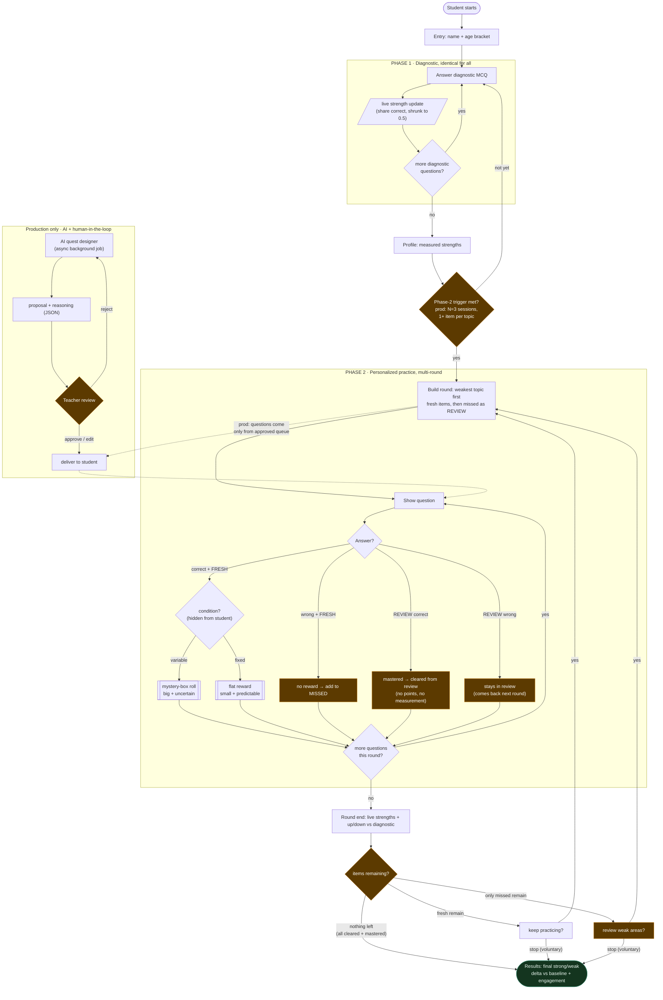

## ⚠️ Superseded — 28 Jul 2026

This document describes the Phase 1 → Phase 2 trigger and the variable-reward experiment that were planned before 27 Jul 2026. On 27 Jul the supervisor pivoted to a simpler gamified adaptive-learning dashboard. **This document is now a historical record and does not describe the built system.**

See `docs/architecture/2026-07-28_architecture-as-built.md` for the system as actually implemented.

---

# Roadmap and App Flow: Visual Companion

Two canonical diagrams for the AI-Personalized Gamification project. Companion to `2026-07-27_architecture-and-model-comparison.md`. Renders on GitHub.

---

## 1. Build roadmap (phase / week)

Where the project is and where it goes. Week 1 is done, and the interactive prototype was built ahead of schedule: the reward economy and two-phase loop already exist client-side, and weeks 2 to 8 turn that into the real backend, AI, and human-in-the-loop system.

Two meanings of "phase," which shouldn't be conflated:
- Build phases are the roadmap sections above (Foundation, then Data+AI, then human-in-the-loop, then Pilot).
- Student phases are Phase 1 (the identical diagnostic baseline) and then Phase 2 (AI-personalized), switched per student by the trigger (in production, N=3 sessions with at least one item per top-level topic). This is shown in the flow below.

---

## 2. End-to-end app flow (with edge cases)

The full student journey plus the production human-in-the-loop path. The amber nodes are the edge cases you'd otherwise miss.

### Edge cases captured (checklist)
- A wrong fresh answer earns no reward, and the item enters the MISSED pool.
- A review re-attempt keeps the weak topic in rotation: correct means mastered and cleared, wrong means it stays, and neither pays points nor moves the measurement.
- Once the fresh pool is exhausted, rounds become Review-only ("Review weak areas").
- When everything is cleared and mastered, the loop stops honestly (in production it would AI-generate fresh items).
- A voluntary stop at any round end is itself the engagement dependent variable.
- If the Phase-2 trigger isn't yet met, the student stays in the baseline.
- In the production human-in-the-loop path, AI proposals are async and the teacher can reject one (which loops back to the designer), so only approved quests reach a student. MCQs are pre-generated and DB-served, which keeps it rate-limit-proof.
- The hidden condition (fixed or variable) is never shown to the student; it appears only in the researcher view and the logs.
