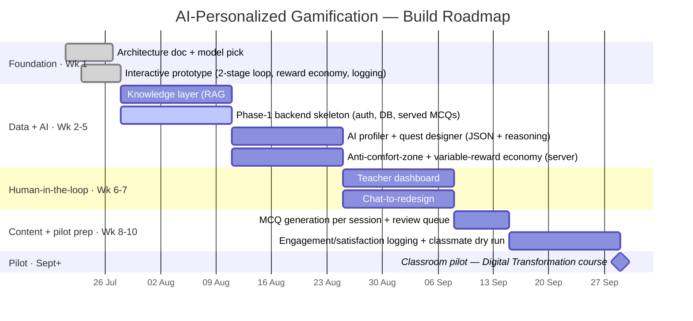

# Roadmap & App Flow — Visual Companion

Two canonical diagrams for the AI-Personalized Gamification project. Companion to `2026-07-27_architecture-and-model-comparison.md`. Renders on GitHub.

---

## 1. Build roadmap (phase / week)

Where the project is and where it goes. **Week 1 is done** — and the interactive prototype was built *ahead* of schedule (the reward economy + two-phase loop already exist client-side; weeks 2–8 turn that into the real backend + AI + human-in-the-loop system).



**Two meanings of "phase" (don't conflate):**
- *Build phases* = the roadmap sections above (Foundation → Data+AI → HITL → Pilot).
- *Student phases* = **Phase 1** (identical diagnostic baseline) → **Phase 2** (AI-personalized), switched per student by the trigger (prod: N=3 sessions, ≥1 item per top-level topic). Shown in the flow below.

---

## 2. End-to-end app flow (with edge cases)

The full student journey plus the production human-in-the-loop path. **Amber nodes are the edge cases** you'd otherwise miss.

```mermaid
flowchart TD
    Start([Student starts]) --> Entry["Entry: name + age bracket"]
    Entry --> D

    subgraph P1["PHASE 1 · Diagnostic — identical for all"]
      D["Answer diagnostic MCQ"] --> Measure[/"live strength update<br/>(share correct, shrunk to 0.5)"/]
      Measure --> Dmore{"more diagnostic<br/>questions?"}
      Dmore -- yes --> D
    end
    Dmore -- no --> Profile["Profile: measured strengths"]

    Profile --> Trig{"Phase-2 trigger met?<br/>prod: N=3 sessions,<br/>1+ item per topic"}
    Trig -- "not yet" --> D
    Trig -- yes --> Build

    subgraph P2["PHASE 2 · Personalized practice — multi-round"]
      Build["Build round: weakest topic first<br/>fresh items, then missed as REVIEW"] --> Q["Show question"]
      Q --> A{"Answer?"}

      A -- "correct + FRESH" --> Cond{"condition?<br/>(hidden from student)"}
      Cond -- variable --> Roll[["mystery-box roll<br/>big + uncertain"]]
      Cond -- fixed --> Flat[["flat reward<br/>small + predictable"]]

      A -- "wrong + FRESH" --> Miss["no reward → add to MISSED"]
      A -- "REVIEW correct" --> Master["mastered → cleared from review<br/>(no points, no measurement)"]
      A -- "REVIEW wrong" --> Keep["stays in review<br/>(comes back next round)"]

      Roll --> NextQ
      Flat --> NextQ
      Miss --> NextQ
      Master --> NextQ
      Keep --> NextQ
      NextQ{"more questions<br/>this round?"} -- yes --> Q
    end

    NextQ -- no --> RoundEnd["Round end: live strengths + up/down vs diagnostic"]
    RoundEnd --> More{"items remaining?"}
    More -- "fresh remain" --> Cont["keep practicing?"]
    More -- "only missed remain" --> ContR["review weak areas?"]
    More -- "nothing left<br/>(all cleared + mastered)" --> Results

    Cont -- yes --> Build
    ContR -- yes --> Build
    Cont -- "stop (voluntary)" --> Results
    ContR -- "stop (voluntary)" --> Results

    Results([" Results: final strong/weak<br/>delta vs baseline + engagement "])

    subgraph PROD["Production only · AI + human-in-the-loop"]
      QD["AI quest designer<br/>(async background job)"] --> Reason["proposal + reasoning (JSON)"]
      Reason --> Teacher{"Teacher review"}
      Teacher -- "approve / edit" --> Deliver["deliver to student"]
      Teacher -- reject --> QD
    end
    Build -. "prod: questions come<br/>only from approved queue" .-> Deliver
    Deliver -. .-> Q

    classDef edge fill:#5c3a00,color:#fff,stroke:#c77e12,stroke-width:1px;
    class Miss,Master,Keep,ContR,More,Teacher,Trig edge
    classDef done fill:#14351f,color:#eaf7ef,stroke:#2e7d62;
    class Results done
```

### Edge cases captured (checklist)
- **Wrong fresh answer** → no reward, item enters the **MISSED** pool.
- **Review re-attempt** → keeps the weak topic in rotation; **correct = mastered/cleared**, **wrong = stays**; neither pays points nor moves the measurement.
- **Fresh pool exhausted** → rounds become **Review-only** ("Review weak areas").
- **Everything cleared + mastered** → the loop **stops honestly** (prod would AI-generate fresh items).
- **Voluntary stop at any round end** → this *is* the engagement dependent variable.
- **Phase-2 trigger not yet met** → student stays in baseline.
- **Production HITL** → AI proposals are async; **teacher can reject** (loops back to the designer) so only **approved** quests reach a student. MCQs are pre-generated and DB-served (rate-limit-proof).
- **Hidden condition** → fixed/variable is never shown to the student (only the researcher view / logs).
