# User Journey: Student Experience (28 Jul 2026)

As of commit e0b3fd9, the application is a single-session adaptive learning quiz. A student who visits the URL lands on the dashboard and plays through a single unbroken session; their score persists only while the browser tab is open.

---

## The Journey

### 1. You land on the dashboard

No login screen. No sign-up. You arrive directly on the dashboard — a dark, glowing screen showing your session stats in real time.

You see:
- **Net Points**: your score after all penalties have been applied. This is the headline number, big and animated.
- **Potential Points**: the score you would have if every answer had been correct. A smaller, secondary stat to show what perfect play would be worth.
- Four supporting stats below: **Rounds Played** (how many times you've hit "Start Round"), **Accuracy** (percentage correct), **Continues** (times you've chosen "Keep Going"), and one more that tracks your performance under your chosen challenge lever — either **Peak Difficulty** (in Adaptive Difficulty mode) or **Fastest Answer** (in Time Pressure mode).
- A grid of game mode cards. Today, only **Quiz** is active, with two entry paths: **Rapid Round** (10 questions) and **Normal** (20 questions). Other cards — Crossword, Word Search, Match-the-Following — exist but are marked "Coming soon".
- A bold **Play Quiz** button that anchors the card.

You've never been asked who you are. There's no teacher waiting on the other end. The app has no memory of whether you visited yesterday or this is your first time. You're anonymous and now.

### 2. You pick your mode and challenge

You click **Rapid** or **Normal**, and the app drops you into the game-setup screen.

You see:
- A recap of your choice: "Rapid Round (10 questions)" or "Normal (20 questions)".
- A clear statement of the points rules: **+20 for correct, −10 for wrong**. There's real downside to guessing.
- Two large, clickable cards for your **Challenge Lever**. You pick exactly one:
  - **Adaptive Difficulty**: questions get harder after you answer correctly (difficulty goes up by 1), and easier after you're wrong (difficulty goes down by 1). Difficulty is locked to a range of 1 to 5. All questions start at level 3.
  - **Time Pressure**: you start with 10 seconds to answer. Each correct answer shaves 2 seconds off the timer for the next question. Each wrong answer or timeout leaves the timer as is. The timer never drops below 5 seconds. Difficulty stays at level 3 for all questions.
  
  You cannot pick both. You cannot pick neither.

- A large **Start Round** button to begin.

### 3. You play the quiz

You're now in the quiz. One question appears on screen, with four answer options arranged as large, clickable buttons.

As you play, you see:
- Your **Net Score** running at the top, updating immediately after each answer.
- **Progress**: which question you're on (e.g., "Question 3 of 10").
- **Your chosen challenge**: either a badge showing your current **Difficulty Level** (if you picked Adaptive), or a **countdown timer** pulsing (if you picked Time Pressure).

When you answer:
- **Correct**: the screen glows green, **+20 points** animates upward, the correct answer is highlighted, and you see a brief "Correct" message. You tap **Next Question** to move on.
- **Wrong**: the screen flashes red, **−10 points** animates downward, the correct answer is highlighted, and you see a brief "Wrong" message. You tap **Next Question**.
- **Time runs out** (only in Time Pressure mode): the timer hits zero before you click anything. That's treated as a wrong answer: **−10 points**, red flash, the correct answer is shown, and you see "Time up". You tap **Next Question**.

This repeats for every question in your round. On the last question, the button changes to **See Results**.

### 4. Your round ends — and you decide what's next

The results screen shows you the score you just earned, broken down:
- Your **Net Score** (after penalties).
- **Correct** vs **Wrong** counts.
- **Gross Points** gained and **Penalty** applied.
- A **Peak Stat**: either the highest difficulty level you reached (if you played Adaptive), or your fastest answer time (if you played Time Pressure).

Two buttons compete for your attention:
- **Keep Going → Next Round**: a large, tempting, energetic button. Tapping it increments your **Continues** counter and drops you straight back into the quiz — the **same challenge lever you picked carries over**, the **same mode carries over** (Rapid or Normal), and you play another round without returning to game-setup. This is the persistence loop we're measuring.
- **Back to Dashboard**: a quieter secondary option that takes you back to the home screen.

Most of the time, you'll see the "Keep Going" button and feel the pull to keep playing. Tapping it feels like the natural thing to do.

---

## What you never see

**Login and signup screens** exist in the codebase but nothing links to them. They authenticate nothing. You are never asked for an email, password, or student ID. No teacher sees you or your answers. Your session has no identity — if you close the browser and return tomorrow, the app starts fresh with zero points and zero memory of you.

**AI personalization** is not here yet. All students see the same 20-question seed bank of multiple-choice questions about Digital Transformation (the course material). Your answers don't cause the AI to retool the next question — they only change difficulty or time pressure based on the lever you chose. No AI has looked at your performance to design a quest for you.

**A teacher-facing view** does not exist. There is no approval dashboard. No reasoning behind questions. The teacher is not in this loop.

**Cross-session identity** is not possible. You have a browser-side session ID (logged locally), but the server has no persistent student record. If you play today and tomorrow, they are separate sessions with separate scores. No cumulative leaderboard, no week-over-week progress chart — the app has one session per browser.

---

## Where the experience breaks

**If you close the browser tab**, your session is gone. Your score, your round count, your continues — all of it lives in `sessionStorage` under the key `alg.session.v1`. The moment the tab closes, the session ends.

**If the database (Neon) is not configured** or the network fails, the app still runs. It falls back to a hardcoded 20-question seed bank and continues to ask those same questions every time. Event logging (clicks, answers, rounds) silently fails — no error message, no alert. You, the student, notice nothing wrong; the game feels normal and keeps score normally. But nothing is being recorded for the research paper.

**If you refresh the page mid-round**, the round restarts from the first question. Everything the round was tracking — which question you were on, your streak, the difficulty you had climbed to, the time remaining — is component state and does not survive the reload. Your cumulative session totals do survive, along with your mode and lever choice, because those live in `sessionStorage`. So you keep your score and stay in the same game; you just lose the round in progress and start it over.

---

## Flow Diagram

```mermaid
graph TD
    A["Dashboard<br/>Net Points + Stats"] -->|Play Quiz| B["Choose Mode<br/>Rapid or Normal"]
    B -->|Selected| C["Choose Challenge<br/>Adaptive or Time Pressure"]
    C -->|Ready| D["Quiz Starts<br/>Question 1"]
    D -->|Answer| E{Correct?}
    E -->|Yes<br/>+20 pts| F["Show Feedback<br/>Green Glow"]
    E -->|No or Timeout<br/>-10 pts| G["Show Feedback<br/>Red Flash"]
    F --> H{Last<br/>Question?}
    G --> H
    H -->|No| D
    H -->|Yes| I["Results Screen<br/>Score + Peak Stat"]
    I -->|Keep Going| D
    I -->|Back to Dashboard| A
    
    style A fill:#1a1a2e
    style B fill:#16213e
    style C fill:#16213e
    style D fill:#0f3460
    style E fill:#e94560
    style F fill:#00d084
    style G fill:#ff4757
    style H fill:#e94560
    style I fill:#1a1a2e
```

---

## Where this lives in the code

- **Dashboard**: `/app/page.tsx` — renders the entry screen, fetches session state from `sessionStorage`, displays the stats, and provides the "Play Quiz" entry point.
- **Mode selection**: `/app/game-setup/page.tsx` — shows the Rapid / Normal choice and the Adaptive / Time Pressure toggle. Validates that exactly one challenge is selected, then sets up the session and navigates to the quiz.
- **Quiz screen**: `/app/quiz/page.tsx` — manages question sequencing, answer validation, scoring, and timeout logic. Updates the session state after each answer and drives the adaptive-difficulty or time-pressure logic.
- **Results screen**: `/app/results/page.tsx` — displays the round score breakdown and the peak stat. The "Keep Going" button increments the continues counter and loops back to the quiz. "Back to Dashboard" clears the round state and navigates home.
- **Session state**: stored in `sessionStorage` under `alg.session.v1` as a JSON object containing score, round count, continues, accuracy, current difficulty, and timer state. This persists only for the duration of the browser tab.
- **Game logic**: `/lib/gameLogic.ts` handles scoring, difficulty adjustments, time-pressure math, and outcome determination.
- **Questions**: `/lib/questions.json` contains the hardcoded 20-question seed bank. When Neon is configured, this will be replaced with queries from the database, but the fallback bank allows the app to run offline.
